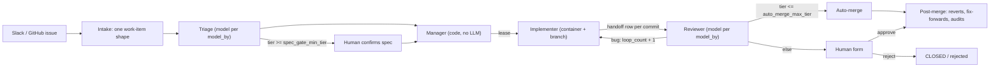

# 1. Shape

```mermaid
graph LR
  S["Slack / GitHub issue"] --> I["Intake: one work-item shape"]
  I --> T["Triage (model per model_by)"]
  T -->|"tier >= spec_gate_min_tier"| H1["Human confirms spec"]
  T --> M["Manager (code, no LLM)"]
  H1 --> M
  M -->|"lease"| W["Implementer (container + branch)"]
  W -->|"handoff row per commit"| R["Reviewer (model per model_by)"]
  R -->|"bug: loop_count + 1"| W
  R -->|"tier <= auto_merge_max_tier"| AM["Auto-merge"]
  R -->|"else"| H2["Human form"]
  H2 -->|"reject"| C["CLOSED / rejected"]
  AM --> PM["Post-merge: reverts, fix-forwards, audits"]
  H2 -->|"approve"| PM
```

## History

No earlier decision is recorded for this topic.
